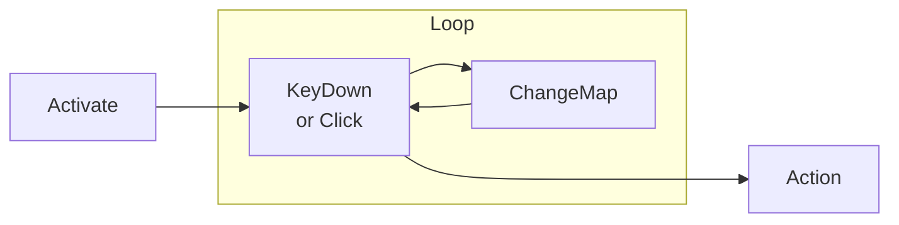

# QwertyLauncher
QwertyLauncher は Windows 上で動作するアプリ・マクロランチャーです。
少ない操作で多くものを選択できるように開発しています。キーフックを使用して作業中のウィンドウからフォーカスを奪わずにタスクを実行できます。

## How to use ?
実行するとタスクトレイに常駐し、指定されたキーを2度押し、あるいはタスクバーをダブルクリックでメインウィンドウが表示されます。
対応するキーを押すか、クリックすると登録されたアクションを実行します。
編集は右クリックです。

## Change Map

いわゆるページ変更です。メモリの許す限り登録を増やすことができます。

## Configuration
トレイアイコンメニューに設定があります。
設定ファイルは実行ファイルと同じフォルダに json 形式で保存されます。たくさんキーを登録するには、直接編集できたらいいですよね？
設定ファイルに変更があれば自動的に再読み込みします。Syntaxエラーで起動しなくならないようにバックアップは忘れずに:)

## Macro
SendInputでキーボード・マウス操作を再現します。
キー編集画面でマクロ記録ボタンを押すと記録モードに入ります。
キーボードのいずれかのキーを押すと記録開始、そのキーをもう一度押すと記録終了となります。

## 